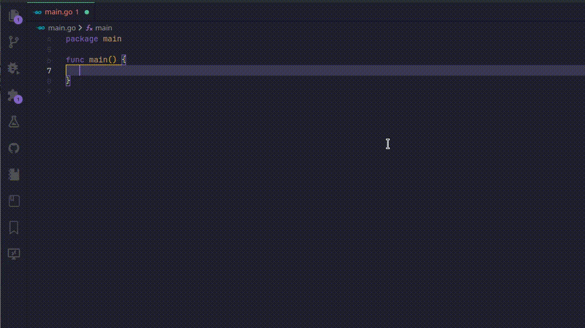
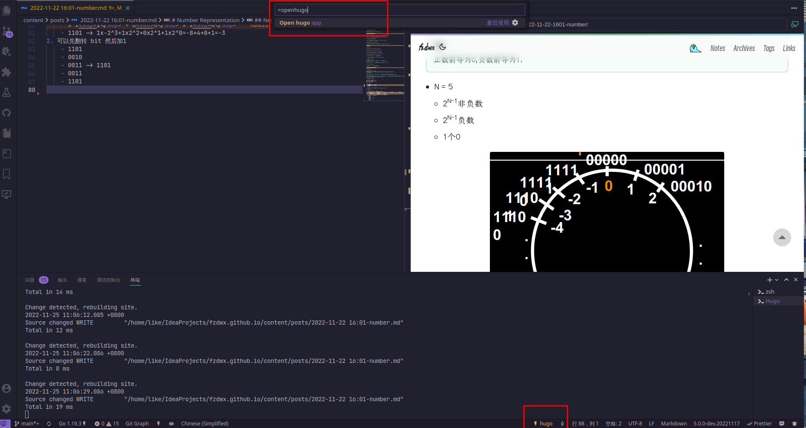

# code-worker

repo: <https://github.com/fzdwx/code-worker>

## Features

1. add semicolon
   - java
   - typescript
   - rust

2. extract variables
   - java
   - rust
   - javascript
   - typescript
   - go
3. postfix
   - ref -> `${expr}.ref -> &${expr}`
   - ret -> `${expr}.ret -> retrun ${expr}`
   - go:
     - fori
     - forr
     - if
     - len
   - rust
     - ok
4. hugo preview
   - require:`browse-lite`
   - add config:
     `"browse-lite.chromeExecutable": "/usr/bin/google-chrome-stable",`

# show

## postfix preview

## hugo preview

**Enjoy!**
